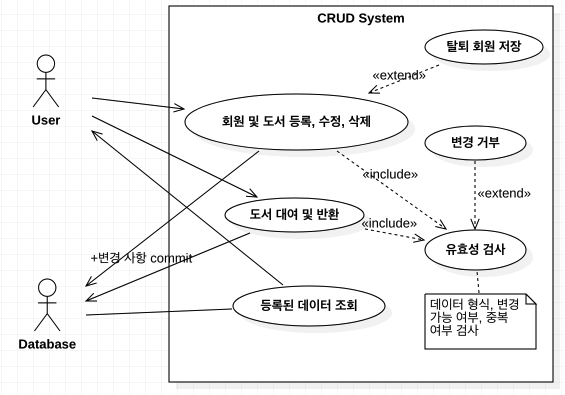
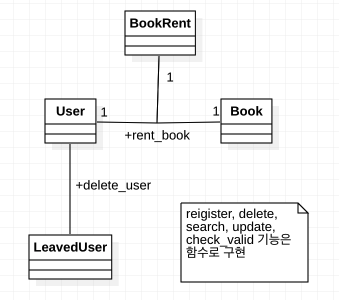

# Book Rental Service
요구사항 명세서에 근거해 간소화된 분석, 설계, 구현 단계를 거쳐 도서 대출 관리 시스템을 구축

## Overview
도서와 회원 정보를 등록 후, 등록한 회원이 도서를 대여할 수 있는 프로그램을 개발

## Requirements Specification
- 도서를 등록, 수정, 삭제할 수 있어야 한다.
  - 도서 정보는 제목, 저자, 가격, 관련 링크, 사진, ISBN, 도서 설명을 포함해야 한다.
  - 도서 중복 등록 시 "이미 등록된 도서입니다." 메시지가 표시되어야 한다.(ISBN으로 중복 체크)
  - 사진을 PC에 저장된 사진을 선택 등록할 수 있어야 한다.
  - 도서별 대여여부 확인할 수 있어야 한다.
  - 대여중인 도서는 삭제할 수 없어야 한다.(반납 후 삭제 가능)
  - "제목, 저자"를 대상으로 검색어가 포함된 도서를 검색할 수 있어야 한다.
  - 관련 링크는 웹페이지 바로가기 링크를 제공해야 한다.
- 회원을 등록, 수정, 탈퇴 할 수 있어야 한다.
  - 회원 정보는 이름, 생년월일, 성별, 전화번호, 이메일, 사진을 포함해야 한다.
  - 이름과 생년월일이 중복되는 회원을 등록할 수 없어야 한다.
  - 도서를 대여중인 회원을 탈퇴할 수 없어야 한다.(반납 후 탈퇴 가능)
  - 탈퇴 회원을 확인할 수 있어야 한다.
  - "이름, 전화번호"를 대상으로 검색어가 포함된 회원으로 검색할 수 있어야 한다.
- 등록된 도서를 회원이 대출할 수 있어야 한다.
  - 대출 정보는 도서 정보, 회원 정보, 대여일, 반납 예정일, 반납 여부가 포함되어 있어야 한다.
  - 대출 시 도서 정보, 회원 정보는 기존 정보에서 선택할 수 있어야 한다.
  - 이미 대여 중인 도서는 대출할 수 없어야 한다.
  - 도서 반납 예정일은 도서 대여 후 2주로 한다.
  - 도서 반납은 대출된 도서를 대상으로 진행된다.
- 기타
  - 메모리 누수가 발생하지 않도록 한다.
  - 탭으로 입력항목 이동 시 좌 > 우 , 상 > 하 순서로 포커스가 이동되어야 한다.
  

## 요구사항 분석
### 시스템 기능 식별
- 도서
  - 등록
    - 도서 정보 중복 여부 체크
    - 사진 첨부
  - 조회
    - "제목, 저자"를 대상으로 검색
    - 도서별 대여 여부 확인이 가능
  - 수정
  - 삭제
    - 삭제시 도서 대여 여부 체크

- 회원
  - 등록
    - 회원 정보 중복 여부 체크
  - 조회
    - "이름, 생일"을 대상으로 검색
    - 탈퇴 회원 확인
  - 수정
  - 삭제
    - 삭제시 도서 대여 여부 체크

- 도서 대여
  - 대여
    - 기존 회원과 도서 정보에서 선택
    - 회원 및 도서의 대출 가능 여부 체크
  - 조회
  - 반납
    - 반납 예정일 설정(대여 후 2주)

### 유스케이스 다이어그램

### 고수준 유스케이스 및 확장 유스케이스, 시스템 순차 다이어그램
- 일정 관계상 생략

### 도메인 모델

### [시스템 오퍼레이션 정의](app/app/process_data.py)
|이름| add_entry(table, row) |
|:---:|:---------------|
|책임 | **테이블에 row를 추가** |
|예외조건|개체 무결성 제약 조건 위배시 오퍼레이션 중단|
|출력|해당사항 없음|
|사전조건|데이터베이스 매핑이 완료되어 있어야 함|
|사후조건|데이터베이스에 변경 사항 commit|

|이름| delete_entry(table, row_id) |
|:---:|:---------------|
|책임 | **테이블에서 id에 해당하는 row 삭제** |
|예외조건|id에 해당하는 row가 없을 경우 오퍼레이션 중단|
|출력|해당사항 없음|
|사전조건|데이터베이스 매핑이 완료되어 있어야 함|
|사후조건|데이터베이스에 변경 사항 commit|

|이름| search_entry(table, expr) |
|:---:|:---------------|
|책임 | **표현식과 일치하는 row 검색 후 반환** |
|예외조건| 표현식의 데이터 형식(int, string)에 따라 유동적으로 탐색 |
|출력|해당사항 없음|
|사전조건|데이터베이스 매핑이 완료되어 있어야 함|
|사후조건|해당 사항 없음|

|이름| get_rent_day() |
|:---:|:---------------|
|책임 | **도서 대여일과 반납 예정일을 string, string으로 반환** |
|예외조건| 해당 사항 없음 |
|출력|해당사항 없음|
|사전조건| 해당 사항 없음|
|사후조건| 해당 사항 없음|

## 설계

### Architecture
MVC Pattern 참고, 구조 설계

1. 사용자가 정보를 요청
2. Controller가 Model(DB, Python Script)과 상호작용
  - 사용자가 요청한 정보 획득
  - 사용자의 요청대로 기존 데이터를 변경
3. 2의 동작 수행의 결과에 따라 사용자 화면을 동적으로 구성, 사용자에게 전달

### Request & Response
사용자와 상호작용을 위한 요청 및 응답 흐름은 아래와 같음.

1. 사용자가 URL을 통해 정보를 요청
2. 플라스크가 URL을 Routing, 파이썬 코드 실행
3. 코드 실행 결과 반환
4. 반환된 결과를 포함한 동적 웹 페이지 작성
5. 웹 페이지를 사용자에게 표시

### DB 스키마 설계

## 구현
분석 및 설계 단계 산출물에 근거하여 프로그램 구현

### [process_data.py](app/app/process_data.py)

- 설계 단계에서 산출된 오퍼레이션 구현
- 데이터베이스 입출력 추상화

### [user.py](app/app/user.py)
사용자 데이터 제어를 책임
- 사용자 등록
- 사용자 조회
- 사용자 수정
- 사용자 삭제
- Ajax 활용 유효성 검사

### [book.py](app/app/book.py)
도서 데이터 제어를 책임
- 도서 등록
- 도서 조회
- 도서 수정
- 도서 삭제
- Ajax 활용 유효성 검사

### [rent.py](app/app/rent.py)
도서 대여 데이터 제어를 책임
- 도서 대출
- 도서 반납
- Ajax 활용 유효성 검사

### [model.py](app/app/models.py)
- 데이터베이스와의 매핑을 위한 클래스 명시

## 실행 화면

### [Index](app/app/templates/index.html)

- 기본 페이지
- 상단 네비게이션 바를 통해 기능 선택 가능

### [Register](app/app/templates/user/user_register.html)

- 회원 또는 도서 등록 페이지
- 회원의 경우, 이름과 생년월일을 통해 유효성 검사
- 도서의 경우, ISBN으로 유효성 검사
- 유효성 검사 시 Ajax 방식으로 입력한 회원 정보와 중복된 데이터가 있는지에 대한 검증을 서버에게 요청
- 중복 검사를 하지 않을 경우 버튼 비활성, 중복 검사 결과에 따라 버튼 활성화

### [Update](app/app/templates/user/user_register.html)

- 회원 또는 도서 정보 수정 페이지
- 유효성 검사 조건은 Register 페이지와 동일
- 기존 데이터가 존재할 경우에만 정보 수정 가능
- 유효성 검사를 하지 않을 경우 버튼 비활성, 중복 검사 결과에 따라 버튼 활성화

### [Success or Failed](app/templates/success_or_failed.html)

- 모든 작업의 실패 또는 성공 여부를 사용자에게 알림
- 수행 작업에 따라 문구 변경

### Show [User](app/app/templates/user/user_search.html) or [Book](app/app/templates/book/book_search.html) List

- 데이터베이스에 존재하는 모든 회원 또는 도서를 출력
- 회원의 경우, 이름과 생일로 검색이 가능
- 도서의 경우, 도서의 제목과 저자로 검색이 가능
- 페이지 사용자가 입력한 데이터와 "가장 유사한" row를 검색하여 출력
- 만약 입력한 데이터와 일치하는 row가 없을 경우, 상황에 맞는 페이지 출력

### [Detail](app/app/templates/user/user_info.html)

- 회원 또는 도서의 사진과 정보 출력
- 해당 페이지에서 사용자 또는 도서 삭제 가능
- 회원이 책을 빌리고 있는 경우, 도서가 대여 중인 경우 삭제 버튼이 비활성화됨

### [Rent](app/app/templates/rent/rent_register.html)

- 도서의 ISBN과 회원의 이름, 생일로 책 대여
- 책을 이미 대여하고 있는 회원의 경우, 이미 대여 중인 도서인 경우 도서 대출이 거절됨.

### [Rent List]

- 대여된 도서의 정보를 표시
- Return Book 버튼을 클릭할 경우, 도서 반납이 가능
