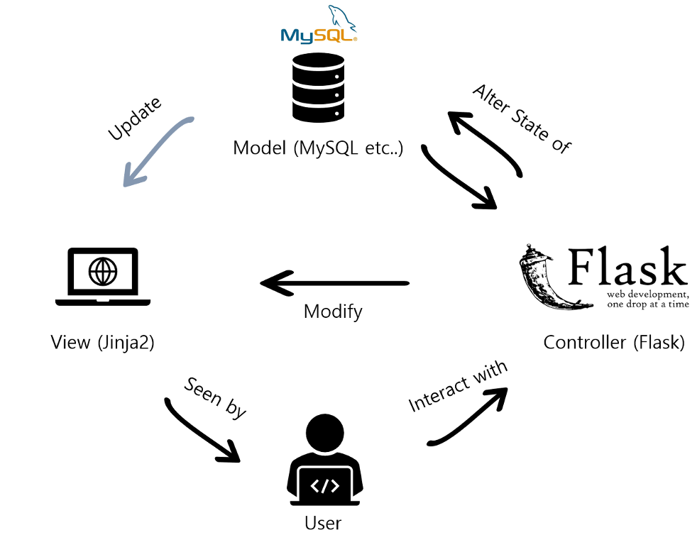
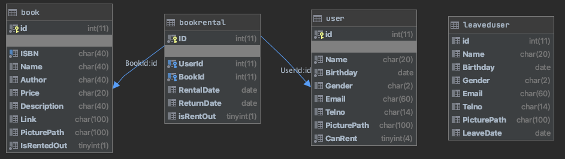

# Book Rental Service
요구사항 명세서에 근거해 분석, 설계, 구현 및 테스트를 진행하여 도서 대출 관리 시스템을 구축

## Overview
도서와 회원 정보를 등록 후, 등록한 회원이 도서를 대여할 수 있는 프로그램을 개발

## Requirements Specification

## Design

### Request & Response
사용자와 상호작용을 위한 요청 및 응답 흐름은 아래와 같음.

### Architecture

### DB Schema

## 구성
### [user.py](app/user.py)
사용자 데이터 제어를 책임
- 사용자 등록
- 사용자 조회
- 사용자 수정
- 사용자 삭제
- Ajax 활용 유효성 검사

### [book.py](app/book.py)
도서 데이터 제어를 책임
- 도서 등록
- 도서 조회
- 도서 수정
- 도서 삭제
- Ajax 활용 유효성 검사

### [rent.py](app/rent.py)
도서 대여 데이터 제어를 책임
- 도서 대출
- 도서 반납
- Ajax 활용 유효성 검사

### [model.py](app/models.py)
- 데이터베이스와의 매핑을 위한 클래스 명시

## 실행 화면

### [Index](app/templates/index.html)

- 기본 페이지
- 상단 네비게이션 바를 통해 기능 선택 가능

### [Register](app/templates/user/user_register.html)

- 회원 또는 도서 등록 페이지
- 회원의 경우, 이름과 생년월일을 통해 유효성 검사
- 도서의 경우, ISBN으로 유효성 검사
- 유효성 검사 시 Ajax 방식으로 입력한 회원 정보와 중복된 데이터가 있는지에 대한 검증을 서버에게 요청
- 중복 검사를 하지 않을 경우 버튼 비활성, 중복 검사 결과에 따라 버튼 활성화

### [Update](app/templates/user/user_register.html)

- 회원 또는 도서 정보 수정 페이지
- 유효성 검사 조건은 Register 페이지와 동일
- 기존 데이터가 존재할 경우에만 정보 수정 가능
- 유효성 검사를 하지 않을 경우 버튼 비활성, 중복 검사 결과에 따라 버튼 활성화

### [Success or Failed](app/templates/success_or_failed.html)

- 모든 작업의 실패 또는 성공 여부를 사용자에게 알림
- 수행 작업에 따라 문구 변경

### Show [User](app/templates/user/user_search.html) or [Book](app/templates/book/book_search.html) List

- 데이터베이스에 존재하는 모든 회원 또는 도서를 출력
- 회원의 경우, 이름과 생일로 검색이 가능
- 도서의 경우, 도서의 제목과 저자로 검색이 가능
- 페이지 사용자가 입력한 데이터와 "가장 유사한" row를 검색하여 출력
- 만약 입력한 데이터와 일치하는 row가 없을 경우, 상황에 맞는 페이지 출력

### [Detail](app/templates/user/user_info.html)

- 회원 또는 도서의 사진과 정보 출력
- 해당 페이지에서 사용자 또는 도서 삭제 가능
- 회원이 책을 빌리고 있는 경우, 도서가 대여 중인 경우 삭제 버튼이 비활성화됨

### [Rent](app/templates/rent/rent_register.html)

- 도서의 ISBN과 회원의 이름, 생일로 책 대여
- 책을 이미 대여하고 있는 회원의 경우, 이미 대여 중인 도서인 경우 도서 대출이 거절됨.

### [Rent List]

- 대여된 도서의 정보를 표시
- Return Book 버튼을 클릭할 경우, 도서 반납이 가능
